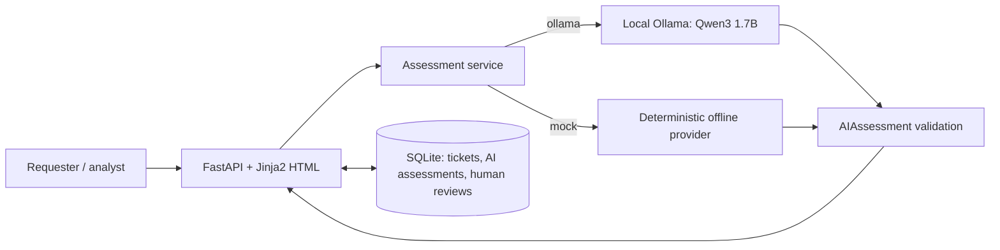

# AI Service Triage PoC

A local AI-assisted IT request triage application that recommends classification, priority, and a support team while keeping the final decision with an analyst.

**Evidence:** 50 synthetic tickets; 100 real LLM assessments; Qwen3 1.7B selected; 68 automated tests passing; 10/10 manual UAT scenarios reported PASS.

## Business problem

IT analysts interpret free-text requests, assess business impact, and choose a support team. This PoC tests a small local model's ability to support those decisions, with analyst review before acceptance. Handling-time savings have not been measured.

## Assessment and human review

The proposed **TO-BE workflow** is:

1. **Submit:** validate title/description and save an ID and timestamp.
2. **Analyze:** recommend category, priority, summary, team, and a human-review flag.
3. **Review:** approve unchanged or edit category, priority, and team.
4. **Retain both:** display the original recommendation and separately saved human decision.

Six categories cover Network, Hardware, Software, Account Access, Security, and Other. Low through Critical priorities follow the shared [business-impact policy](app/assessment_policy.txt). Teams are recommended; work is not dispatched automatically.

## Architecture



Both providers share a strict contract; application and benchmark share the policy. Local Ollama uses structured JSON, temperature 0, and disabled Qwen3 thinking. HTML/CSS is server-rendered.

### Database

Project-root `tickets.db` stores separate tickets, AI assessments, and human reviews across restarts. Database access uses parameterized SQL.

### Routes

`/` holds the form; `/tickets` lists IDs, titles, and times newest first; `/tickets/{id}` shows details and review actions. Actions use HTML form POSTs.

## Model-selection evidence

Measured on the target Dell: **50 synthetic tickets per model, two models, 100 total real LLM assessments**.

| Metric | Qwen3 1.7B | Gemma 3 1B |
| --- | --- | --- |
| Category accuracy | 88.0% | 74.0% |
| Priority accuracy | 92.0% | 64.0% |
| Routing accuracy | 88.0% | 78.0% |
| Valid structured-output rate | 100.0% | 100.0% |
| Average latency | 8.108 s | 5.138 s |
| Median latency | 7.608 s | 4.632 s |

**Gemma was faster; Qwen was materially more accurate for this task. Qwen3 1.7B was selected as the production PoC provider.** Mock remains the development default.

Qwen's weaker areas were Hardware classification (50%) and Medium priority (73.3%); Gemma scored 0% on Critical priority. This synthetic sample does not establish production-grade accuracy. The [model-selection record](docs/model-selection.md) contains breakdowns and methodology. Policy, prompts, and benchmark data are preserved.

## Reliability and controls

- `AIAssessment` rejects malformed JSON, invalid choices, missing/extra fields, and wrong types before persistence or display.
- Human review is mandatory. Approval copies saved values; overrides remain separate. Provider changes cannot replace existing recommendations or final decisions.
- Connection, timeout, HTTP, and output failures are visible, save no assessment, and **never silently fall back to mock**.
- After recovery, retry the same unassessed ticket. Raw internal errors are not displayed.

## Testing and acceptance evidence

**68 automated tests pass**: contracts, mock policy, providers, failures, preservation, and benchmark calculations. Temporary databases and mocked HTTP keep tests offline. See the [regression log](docs/evidence/unit-tests-portfolio-deployment.txt).

**Manual Dell UAT: 10 PASS, 0 FAIL, 0 NOT EXECUTED, 0 open UAT defects**, reported by the tester. Cases include approval/override, preservation, application restart, visible Ollama failure, same-ticket recovery, and provider switching. [Results](docs/uat-results.md) retain screenshot placeholders and coverage limits separately from defects.

## Quick start

Python 3.10+; run from a local checkout. Start with mock, without Ollama:

```bash
python3 -m venv .venv
source .venv/bin/activate
python -m pip install -r requirements.txt
AI_PROVIDER=mock python -m uvicorn app.main:app --reload
```

Open `http://127.0.0.1:8000`. Stop with `Ctrl+C`. Run the full offline suite with:

```bash
python -m unittest discover -s tests -v
```

<details>
<summary>Windows PowerShell quick start</summary>

```powershell
python -m venv .venv
.\.venv\Scripts\python.exe -m pip install -r requirements.txt
$env:AI_PROVIDER = "mock"
.\.venv\Scripts\python.exe -m uvicorn app.main:app --reload
```

Run tests with `.\.venv\Scripts\python.exe -m unittest discover -s tests -v`.

</details>

### Run the application with Ollama on the Dell

Target: **Dell OptiPlex 3050, Intel Core i3-6100T, 2 physical cores / 4 logical processors, 8 GB RAM, no dedicated GPU, Ubuntu Server**.

The [runbook](docs/deployment-runbook.md) covers SSH, systemd installation, logs, updates, rollback, and backups. The service example runs as `farhad` from `/home/farhad/ai-service-triage-poc`, serving `http://<server-ip>:8000`. Ollama is a separate service at `localhost:11434`.

The deployment example selects `AI_PROVIDER=ollama`, `OLLAMA_MODEL=qwen3:1.7b`, and `OLLAMA_TIMEOUT=60`; application defaults remain mock, Qwen3 1.7B, and 120 seconds. Downloads need connectivity; inference is local. Install and verify the service on the Dell.

## Repository and documentation

| Path | Purpose |
| --- | --- |
| `app/` | Routes, database access, assessment schema/policy/providers, templates, CSS |
| `evaluation/` | Separate 50-ticket benchmark and CSV export |
| `tests/` | Offline automated suite |
| `deploy/` | systemd service and environment examples |
| `docs/` | Model selection, deployment, UAT, traceability, and evidence |

Read the [model decision](docs/model-selection.md), [deployment runbook](docs/deployment-runbook.md), [UAT plan](docs/uat-plan.md), [UAT results](docs/uat-results.md), and [requirements-to-UAT traceability](docs/uat-traceability.md).

## Limitations and future work

Use a trusted test network: this local PoC has no authentication or TLS. Model/provider provenance and reviewer identity are not stored. Final decisions cannot be edited again; re-analysis history is absent. Refreshing the submission confirmation POST can duplicate a ticket.

Future scope could include held-out evaluation, access controls, provenance, and operational hardening. These are not implemented; model-accuracy limitations remain separate from UAT defects.
